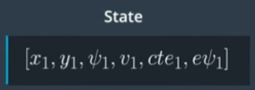
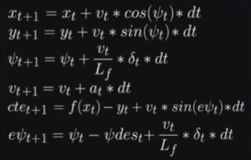

# CarND-Controls-MPC

Author : Manoj Kumar Subramanian

------

## Overview

This repository is as part of my Submission to the Project 5: Model Predictive Control Project for the Udacity Self Driving Car Nano Degree Program Term 2.

In this project,  a Model Predictive controller is realized in C++ to provide the control signals for a vehicle in a simulated environment. This project involves the Term 2 Simulator. The simulator will provide the x,y co-ordinates of waypoints of a track for a few steps, the simulated vehicle's x, y position, its orientation, speed, steering angle and the throttle value. The Model Predictive control has to use these value and provide the target steering angle and throttle values to the simulator to keep the simulated vehicle on the track.

Udacity has provided the following as a starter for this project.

1. A [GitHub repo with starter code](https://github.com/udacity/CarND-MPC-Project) that was forked for this project.
2. A simulator, downloaded from the [releases](https://github.com/udacity/self-driving-car-sim/releases) page of the project repo.

---

## Project Goals

The goals of this project are the following:

- The code must compile without any errors with cmake and make
- MPC class has to be implemented in C++ and the same has to be used to fine tune the control parameters of maneuvering the vehicle around the track in the simulator
- Reflections to be provided on the model created, the hyper parameters setting, pre-processing, latency and tuning components
- Simulation of the vehicle driving itself should meet the criteria of not leaving out of track

------

## Rubric Points

### Compiling without any errors

I have used Docker for Windows using the DockerToolbox setup and pulled the Udacity's Carnd control kit docker container which constituted the necessary tools required (including cmake, make, gcc & git) for the project.

**<u>Basic Build Instructions</u>**

1. Clone this repo.

2. Make a build directory: `mkdir build && cd build`

3. Compile: `cmake .. && make` 

   - On windows, you may need to run: `cmake .. -G "Unix Makefiles" && make`

4. Run it: `./mpc` 

   The program should wait listening to port 4567.

**<u>Running the simulator</u>**

Before running the simulator, configure the port forwarding to the port 4567 since the simulator and the c++ program talk using the uWebSocketIO in port 4567.

Switch to the Project 5: MPC Controller in the simulator and press SELECT. The simulator will send the current state of the vehicle in port 4567 which is used by the C++ program. In return, the program provides the control data for Steering and Acceleration which is used by the simulator to navigate the vehicle through the track.

INPUT: values provided by the simulator to the c++ program

- ["ptsx"] => the x co-ordinates of the way points of the track for next few samples
- ["ptsy"] => the y co-ordinates of the way points of the track for next few samples
- ["x"] => x co-ordinate of current position of the vehicle
- ["y"] => y co-ordinate of current position of the vehicle
- ["psi"] => current orientation of the vehicle
- ["speed"] => current speed of the vehicle in mph
- ["steering_angle"] => current steering angle
- ["throttle"] => current throttle value

OUTPUT: values provided by the c++ program to the simulator

- ["steering_angle"] <= target steering angle for which the car should drive
- ["throttle"] <= target throttle position to maintain speed
- ["mpc_x"] <= the x co-ordinates of the predicted path the vehicle should follow for visualization
- ["mpc_y"] <= the y co-ordinates of the predicted path the vehicle should follow for visualization
- ["next_x"] <= the x co-ordinates of the path given by the simulator in car-coordinates for visualization
- ["next_y"] <= the y co-ordinates of the path given by the simulator in car-coordinates for visualization

------

### **MPC Implementation**

The majority of the code are referenced from the MPC quiz section mentioned as part of the course. The following sections are implemented in the program.

**States**

The following states are assumed for this project based on the general kinematic model of a vehicle. x,y position of the vehicle, psi - orientation, v - speed, cte - cross track error, epsi - error in orientation. These states are fed into the IPOPT solver to produce the desired control parameters of Steering Angle (delta) and throttle (a).



**Model**

The model which is described in the lecture videos is implemented in the FG_eval class, having each state variables to N number of points with the interval of dt.



      // Recall the equations for the model:
      // x_[t+1] = x[t] + v[t] * cos(psi[t]) * dt
      // y_[t+1] = y[t] + v[t] * sin(psi[t]) * dt
      // psi_[t+1] = psi[t] + v[t] / Lf * delta[t] * dt
      // v_[t+1] = v[t] + a[t] * dt
      // cte[t+1] = f(x[t]) - y[t] + v[t] * sin(epsi[t]) * dt
      // epsi[t+1] = psi[t] - psides[t] + v[t] * delta[t] / Lf * dt
      fg[1 + x_start + t] = x1 - (x0 + v0 * CppAD::cos(psi0) * dt);
      fg[1 + y_start + t] = y1 - (y0 + v0 * CppAD::sin(psi0) * dt);
      fg[1 + psi_start + t] = psi1 - (psi0 - v0 * delta0 / Lf * dt);
      fg[1 + v_start + t] = v1 - (v0 + a0 * dt);
      fg[1 + cte_start + t] =
          cte1 - ((f0 - y0) + (v0 * CppAD::sin(epsi0) * dt));
      fg[1 + epsi_start + t] =
          epsi1 - ((psi0 - psides0) - v0 * (delta0 / Lf) * dt);
Note that the fg[0] is dedicated for the cost values to be used by the IPOPT solver.


**Variable upper and lower bounds**

The following boundaries were added to the solver input such that there shall be a limitation in the minimum and maximum values of the control outputs.


  

Steering limited to -25 deg to 25 deg (0.436332 in radians)

    // The upper and lower limits of delta are set to -25 and 25
    // degrees (values in radians).
    for (unsigned int i = delta_start; i < a_start; i++) 
    {
      vars_lowerbound[i] = -0.436332;
      vars_upperbound[i] = 0.436332;
    }
Acceleration output is limited to -1(full brake) to +1(full throttle)
    // Acceleration/decceleration upper and lower limits.
    for (unsigned int i = a_start; i < n_vars; i++) 
    {
      	vars_lowerbound[i] = -1.0;
    	vars_upperbound[i] = 1.0;
    }
  

**Timestep length and Elapsed Duration (N and dt)**

Various values have been tried in this project with the combinations as (N = 10, dt = 0.2), (N= 10, dt = 0.1), (N= 20, dt = 0.05), (N = 30, dt = 0.05), (N=15, dt = 0.1) etc. The more the value of N, the vehicle tend to oversteer, the lesser value of N, produced understeer. The values of **<u>(N = 20, dt = 0.05)</u>** is finally arrived after many iterations.


**Polynomial Fitting**

The polyfit function already defined in the provided source code was used for finding the best fit polynomial for the given way points. 

**Pre-processing**

The way points provided from the simulator were w.r.t to the map co-ordinates. These were transformed to the car co-ordinates using the following code

```c++
// Convert vehicle co-ordinates to map co-ordinates
veh_x = (ptsx[j] - px) * cos(-psi) - (ptsy[j] - py) * sin(-psi);
veh_y = (ptsy[j] - py) * cos(-psi) + (ptsx[j] - px) * sin(-psi);
```
Based on the Polyfit polynomial co-efficients, the cross track error(cte) at x=0, and the orientation error (epsi) were calculated using the Poly eval method.

**Latency**

Since the project requested to deliberately add a delay of 100 microseconds for latency, this time is considered as a latency delay time (delay_t) in the program.

The same model represented above is delayed by this time and the new states are arrived using the below calculations.

    // State after delay.          
    //transition from t to t+1 (time step is delta_t = 0.1)
    // using the general kinematic equations
    
    double delay_x = v * cos(0) * delay_t; // Assuming initial x = 0 in car co-ordinate
    double delay_y = v * sin(0) * delay_t; // Assuming initial y = 0 in car co-ordinate
    double delay_psi = -v * steer_value_i * delay_t / Lf ; // Assuming initial psi = 0 in car co-ordinate
    double delay_v = v + throttle_value_i * delay_t; 
    double delay_cte = cte + v * sin(epsi) * delay_t;
    double delay_epsi = epsi-(v * steer_value_i * delay_t / Lf);
The delayed state values were used in solver for the solver to predict the new values.

    // Update the states to be used in ipopt solver
    Eigen::VectorXd state(6);
    state << delay_x, delay_y, delay_psi, delay_v, delay_cte, delay_epsi;
------

## Simulation Video Link

Here is the link for my video running at a constant speed of 68mph with the cost parameters set as 250000 to minimize the sequential actuations of steering and the cost parameter for acceleration deviation from 0 as 50. https://youtu.be/nrt0mMDVCY0


**Additional Video links for comparison**

`      fg[0] += cost_value[4] * CppAD::pow(vars[a_start + t], 2);`

`fg[0] += cost_value[5] * CppAD::pow(vars[delta_start + t + 1] - vars[delta_start + t], 2);`

| **<u>Video with nominal track following</u>** | **<u>Video for aggressive track following</u>** | **<u>Video for smooth track following</u>** |
| ---------------------------------------- | ---------------------------------------- | ---------------------------------------- |
| https://youtu.be/nrt0mMDVCY0             | https://youtu.be/7_c0i2hVCk8             | https://youtu.be/N3Kp-TdXb6U             |
| `cost_value[4] = 50; cost_value[5] = 250000` | `cost_value[4] = 25; cost_value[5] = 250000` | `cost_value[4] = 100; cost_value[5] = 50000` |


------

## Dependencies

* cmake >= 3.5
 * All OSes: [click here for installation instructions](https://cmake.org/install/)
* make >= 4.1(mac, linux), 3.81(Windows)
  * Linux: make is installed by default on most Linux distros
  * Mac: [install Xcode command line tools to get make](https://developer.apple.com/xcode/features/)
  * Windows: [Click here for installation instructions](http://gnuwin32.sourceforge.net/packages/make.htm)
* gcc/g++ >= 5.4
  * Linux: gcc / g++ is installed by default on most Linux distros
  * Mac: same deal as make - [install Xcode command line tools]((https://developer.apple.com/xcode/features/)
  * Windows: recommend using [MinGW](http://www.mingw.org/)
* [uWebSockets](https://github.com/uWebSockets/uWebSockets)
  * Run either `install-mac.sh` or `install-ubuntu.sh`.
  * If you install from source, checkout to commit `e94b6e1`, i.e.
    ```
    git clone https://github.com/uWebSockets/uWebSockets
    cd uWebSockets
    git checkout e94b6e1
    ```
    Some function signatures have changed in v0.14.x. See [this PR](https://github.com/udacity/CarND-MPC-Project/pull/3) for more details.

* **Ipopt and CppAD:** Please refer to [this document](https://github.com/udacity/CarND-MPC-Project/blob/master/install_Ipopt_CppAD.md) for installation instructions.
* [Eigen](http://eigen.tuxfamily.org/index.php?title=Main_Page). This is already part of the repo so you shouldn't have to worry about it.
* Simulator. You can download these from the [releases tab](https://github.com/udacity/self-driving-car-sim/releases).
* Not a dependency but read the [DATA.md](./DATA.md) for a description of the data sent back from the simulator.


## Basic Build Instructions

1. Clone this repo.
2. Make a build directory: `mkdir build && cd build`
3. Compile: `cmake .. && make`
4. Run it: `./mpc`.
